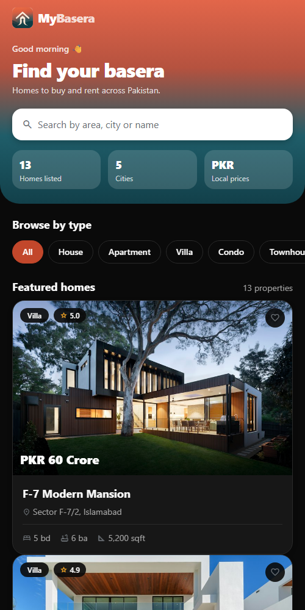
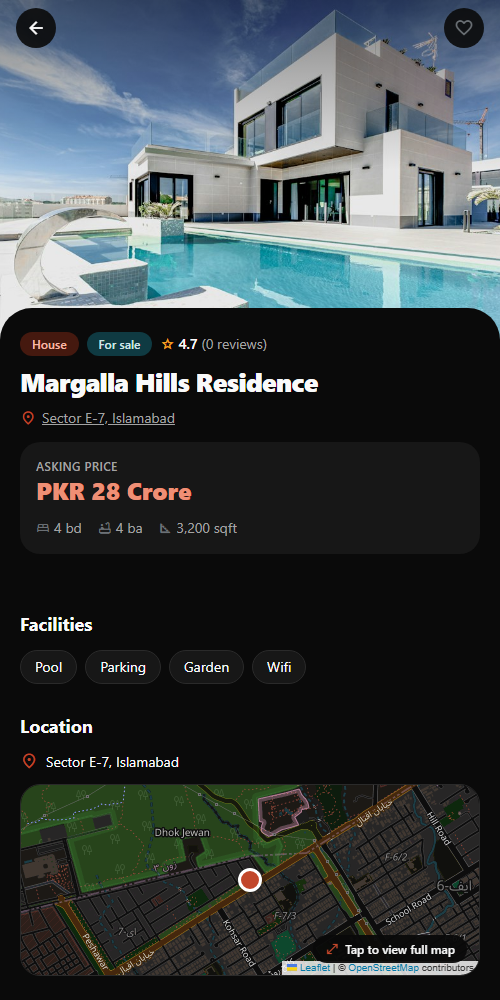
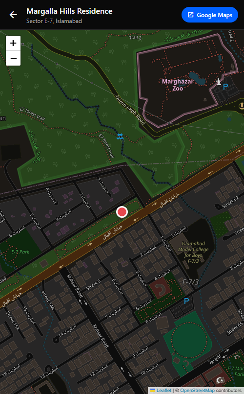
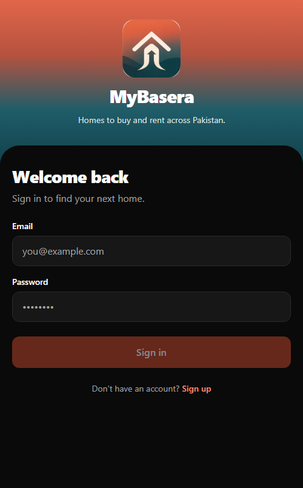
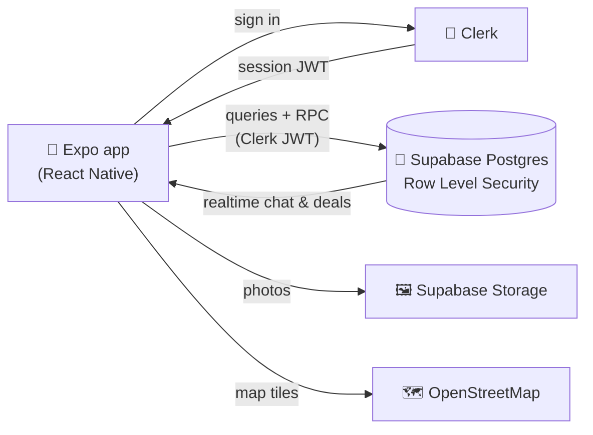
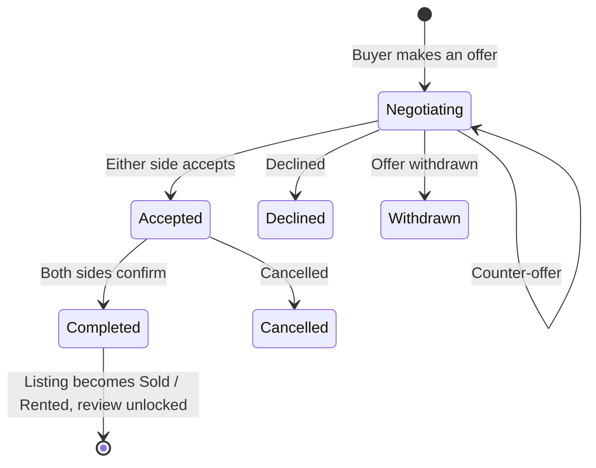

<div align="center">


# MyBasera

**Find your basera — homes to buy and rent across Pakistan.**

A full-stack real-estate marketplace for mobile, built with Expo and React Native. Browse listings in PKR, explore them on a map, chat with agents, negotiate offers and close deals that both sides confirm.

[](https://expo.dev)
[](https://reactnative.dev)
[](https://www.typescriptlang.org)
[](https://supabase.com)
[](https://clerk.com)
[](LICENSE)

[Features](#-features) · [Screenshots](#-screenshots) · [Tech stack](#-tech-stack) · [Getting started](#-getting-started) · [Architecture](#-architecture) · [Security](#-security)

</div>

---

## ✨ Features

### 🏠 Discover
- **Search and filter**: search by area, city or name, then narrow results by type, buy or rent, PKR price range, bedrooms, bathrooms and facilities, with sorting.
- **Local pricing**: amounts are shown in Pakistani units such as *Lakh* and *Crore*.
- **Favorites**: save listings and find them again on any device.

### 🗺️ Maps
- **OpenStreetMap** maps powered by Leaflet. No API key or billing is needed.
- **Location preview** on every listing, with a full-screen map that shows the address and an **Open in Google Maps** button for directions.

### 📝 List a property
- **Anyone can list**: add a photo (stored in Supabase Storage), price, details and facilities.
- **GPS coordinates**: tap **Use my current location**, which asks for permission first, or enter coordinates by hand.
- **Owner tools**: edit, delete, **mark as sold or rented**, or relist.

### 💬 Chat and deals
- **Realtime chat** between buyers or tenants and agents. Each buyer gets one thread per listing.
- **Offers**: make an offer, the other side counters, and either side accepts. Both sides then confirm completion. The listing status updates automatically: *Active* → *Under offer* → *Sold / Rented*.
- **Verified reviews**: you can review a property only after a completed deal.
- **Rental compliance**: completed rentals link to the official provincial **police tenant-registration** services.

### 👤 Account
- Email and password sign-in with Clerk, plus protected routes.
- Profile photo upload, optional public contact details, light and dark appearance, help and about pages.
- **Self-service account deletion.**

## 📱 Screenshots

<div align="center">

| Home | Listing | Full-screen map | Sign in |
| :---: | :---: | :---: | :---: |
|  |  |  |  |

</div>

## 🧰 Tech stack

| Layer | Technology |
| --- | --- |
| **App** | [Expo](https://expo.dev) SDK 57 · React Native 0.86 (New Architecture) · TypeScript · React Compiler |
| **Navigation** | [Expo Router](https://docs.expo.dev/router/introduction/) (file-based, typed routes, protected stacks) |
| **Styling and motion** | [NativeWind](https://www.nativewind.dev) (Tailwind CSS) · [Reanimated 4](https://docs.swmansion.com/react-native-reanimated/) |
| **Auth** | [Clerk](https://clerk.com) |
| **Backend** | [Supabase](https://supabase.com): PostgreSQL with Row Level Security, Storage, Realtime and RPC functions |
| **State** | [Zustand](https://zustand.docs.pmnd.rs) (client-only UI state) |
| **Maps** | [Leaflet](https://leafletjs.com) + [OpenStreetMap](https://www.openstreetmap.org) in `react-native-webview` |
| **Device** | `expo-location` · `expo-image-picker` · `expo-image` |

## 🚀 Getting started

### Prerequisites

- **Node.js 20+** and npm
- A free [Supabase](https://supabase.com) project and a free [Clerk](https://clerk.com) application
- **[Expo Go](https://expo.dev/go)** (SDK 57) on your phone, or an Android or iOS simulator

### 1. Clone and install

```bash
git clone https://github.com/m-zaki27/MyBasera---Modern-real-estate-app.git mybasera
cd mybasera
npm install
```

### 2. Configure environment variables

```bash
cp .env.example .env.local
```

| Variable | Where to find it |
| --- | --- |
| `EXPO_PUBLIC_CLERK_PUBLISHABLE_KEY` | Clerk Dashboard → **API Keys** |
| `EXPO_PUBLIC_SUPABASE_URL` | Supabase → **Project Settings → API** |
| `EXPO_PUBLIC_SUPABASE_KEY` | Supabase → **Project Settings → API** (publishable / anon key) |

> [!WARNING]
> Use **publishable keys only**, because they are bundled into the app. Never put a Clerk secret key or a Supabase service-role key in this project.

### 3. Set up the database

Run every file in [`supabase/migrations/`](supabase/migrations) **in filename order**. You can either:

- paste each file into the Supabase **SQL Editor**, or
- link the project with the [Supabase CLI](https://supabase.com/docs/guides/cli) and run:

  ```bash
  supabase db push
  ```

For demo listings, also run [`supabase/seed.sql`](supabase/seed.sql). It adds fictional agents with placeholder contact details.

### 4. Connect Clerk to Supabase

MyBasera uses Supabase's native **third-party auth** with Clerk, so Row Level Security policies can check who is signed in:

1. In Clerk, open the **Supabase integration** (Dashboard → `setup/supabase`), activate it and copy your Clerk domain.
2. In Supabase, go to **Authentication → Sign In / Providers → Third-Party Auth**, add **Clerk** and paste the domain.
3. In Clerk, enable **Email address** and **Password** sign-in.

### 5. Run the app

```bash
npx expo start --clear
```

Scan the QR code with **Expo Go** (Android) or the **Camera** app (iOS). Or press `a`, `i` or `w` to open Android, iOS or web.

### Scripts

| Command | Description |
| --- | --- |
| `npm start` | Start the Expo dev server |
| `npm run android` · `ios` · `web` | Start the server and open that platform |
| `npm run lint` | Lint with ESLint (`eslint-config-expo`) |
| `npx tsc --noEmit` | Type-check the project |

## 🏗️ Architecture



- **Auth**: Clerk issues the session. The Supabase client sends Clerk's token with each request, and RLS policies read the user from `auth.jwt() ->> 'sub'`.
- **Data integrity**: deal changes happen only through `security definer` database functions, so neither side can skip a step.
- **Client state**: Zustand holds UI-only state such as filters and optimistic favorites. Supabase is always the source of truth.

### Deal lifecycle



### Project structure

```
src/
├── app/            Expo Router screens: (auth), (tabs), property, deal, offer, chat, map …
├── components/     Reusable UI: cards, maps, forms, deal banners, skeletons
├── constants/      Design tokens, brand, police-verification links
├── hooks/          Data hooks wrapping Supabase queries
├── lib/            Supabase client, deal-flow rules, API helpers, formatting
├── store/          Zustand stores
└── types/          Database types
supabase/
├── migrations/     Timestamped SQL migrations (source of truth for the schema)
└── seed.sql        Demo data
```

## 🔒 Security

- **Row Level Security on every table.** Chats, deals and favorites are visible only to the people involved.
- **Column-level grants** keep private fields private. Agent contact details appear only if the agent opts in.
- **Locked-down functions**: default `EXECUTE` is revoked, and only the intended RPCs are granted.
- **Storage rules**: users can upload only into their own folder in the `property-images` bucket.
- **No secrets in the client**: only publishable keys are used, and all `.env*` files are git-ignored.

> [!NOTE]
> Map tiles come from OpenStreetMap's community servers. For high-traffic production use, switch to a commercial OSM tile provider in [`src/lib/leaflet-html.ts`](src/lib/leaflet-html.ts).


## 🤝 Contributing

Contributions, issues and feature requests are welcome. Open an [issue](https://github.com/m-zaki27/MyBasera---Modern-real-estate-app/issues) or submit a pull request.

1. Fork the repo and create a branch: `git checkout -b feature/my-feature`
2. Make sure `npm run lint` and `npx tsc --noEmit` pass.
3. Commit, push and open a pull request.

## 📄 License

Released under the [MIT License](LICENSE). © 2026 Zaki

<div align="center">
<sub>Made with ❤️ in Pakistan</sub>
</div>
